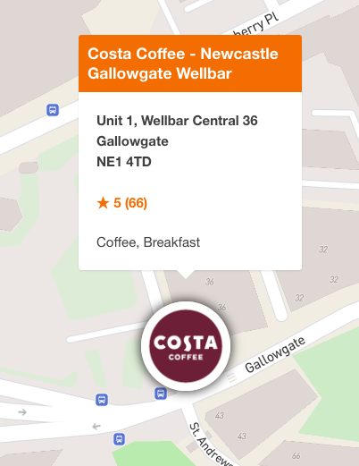

# JustEat-Restaurant-Finder Application

## Description
JustEat-Restaurant-Finder is a web application designed to help users find restaurants near them. It utilizes Mapbox for interactive mapping and geolocation features, and a backend service for restaurant data retrieval.

## Features
- Interactive map to display restaurant locations.
- Search bar to find restaurants by postcode.
- Filter options for search radius, cuisine type, and minimum star rating.

## Feature Highlights

Below are some of the standout features of the JustEat-Restaurant-Finder application, along with screenshots to give you a glimpse of the user interface:

### Interactive Map Display - *An interactive map that users can navigate to see restaurant locations plotted based on their search criteria.*


### Search by Postcode - *A user-friendly search bar that allows users to find restaurants by entering a UK postcode.*


### Filter Options - *Filter the search results by search radius, cuisine type, and minimum star rating to find the perfect dining spot.*


### Detailed Restaurant Information
#### Popup Windows - *View each restaurant's details by clicking on a marker.*

#### Location List - *View each restaurant in a scrollable list.*


## Project Structure

```
.
├── backend
│   ├── api
│   │   ├── __init__.py
│   │   ├── main.py
│   │   ├── models.py
│   │   └── utils.py
│   └── requirements.txt
├── frontend
│   ├── css
│   │   └── style.css
│   ├── images
│   │   └── cutlery.png
│   ├── js
│   │   ├── app.js
│   │   └── config.js
│   └── index.html
├── screenshots
│   ├── filterWindow.png
│   ├── locationList.png
│   ├── mapHighlights.png
│   ├── popUp.png
│   └── searchBar.png
├── .gitignore
├── LICENSE
├── Makefile
└── README.md
```

## Installation
To get the project up and running on your local machine, follow these steps:

1. Clone the repository to your local machine.
   ```sh
   git clone git@github.com:rkemp101/justeat-restaurant-finder.git
   ```

2. Navigate to the cloned repository directory.
    ```sh
    cd justeat-restaurant-finder
    ```

3. Use the Makefile to install dependencies.
    ```sh
    make install
    ```

4. Once the dependencies are installed, you can start the application
    ```sh
    make start
    ```

## Usage
After starting the application using the make start command, the application will open in your default web browser. If it does not open automatically, you can access the frontend by visiting http://localhost:8080 and the backend API at http://localhost:8000.

## Stopping the Application
To get the project up and running on your local machine, follow these steps:

1. To stop the application servers.
   ```sh
   make stop
   ```

2. To clean up compiled Python files and cache.
    ```sh
    make clean
    ```

## Assumptions
When using the JustEat-Restaurant-Finder application, we have made several assumptions:

- **Geographic Limitations**: The application currently assumes that the user is searching for restaurants within the UK, as it is designed to work with UK postcodes and uses the JustEat UK API for data retrieval.
- **Search Radius**: The search functionality uses the center coordinates of a provided UK postcode, validated by Mapbox's Geocoder, as the basis for measuring the straight-line distance (in miles) to the restaurant's coordinates. This distance is not reflective of actual travel distance or travel time.
- **Connectivity**: It is assumed that the user has an active internet connection, as the application requires online access to fetch restaurant data and map information.
- **Browser Compatibility**: The frontend is developed with modern web standards and is assumed to be used with current versions of major web browsers like Chrome, Firefox, Safari, and Edge.
- **API Limitations**: The application's performance is dependent on the JustEat API's and Mapbox API's rate limits and availability, assuming that these external services are operational and not overburdened.
- **Data Accuracy**: The information displayed (such as restaurant locations, ratings, and cuisine types) is assumed to be accurate as provided by the JustEat API.

## Improvements
The JustEat-Restaurant-Finder application could be improved in several ways:

- **Modularity in Codebase**: The application's codebase could be refactored to embrace a more modular design. This would involve:
  - **Decoupling Components**: Breaking down large functions into smaller, reusable components, which would simplify updates and maintenance.
  - **Service Layer Abstraction**: Introducing a service layer to abstract business logic from API routes, making the code cleaner and more testable.
  - **Utilizing Design Patterns**: Applying design patterns where appropriate to solve common problems in a standardized way.
  - **Independent Frontend and Backend Deployment**: Allowing the frontend and backend to be developed and deployed independently to improve the development workflow and enable easier scaling.
  - **Backend Tests**: Introduce unit tests to the backend modules. Particularly important for independent useage as Mapbox API's Geocoder autocomplete currently validates the user input (e.g. UK postcode) on the client-side.
  - **Creating Libraries for Shared Logic**: If there are functionalities that could be shared across different parts of the application (or even across different projects), they could be turned into libraries.
  - **Implementing API Versioning**: Introducing version control for the API endpoints to ensure backward compatibility and make the transition smoother when introducing new features or breaking changes.
- **Expansion to Other Regions**: Currently focused on the UK, the application could be expanded to include other regions by integrating additional APIs and considering local variations in postcode formatting and geolocation.
- **User Authentication**: Implementing user accounts would allow for personalized experiences, such as saving favorite restaurants or custom search preferences.
- **Performance Optimization**: Further optimizations could be made for loading times and responsiveness, particularly when handling large volumes of restaurant data or map interactions.
- **Marker Improvements**: Introduce marker clusters for zoom-levels or areas with a high density of results. Rendering Restaurant logos may not be optimal for load times.
- **Location Precision**: Postcode areas are less precise than street & postcode combinations. This can impact the results returned and behaviour of the search radius filter.
- **Default Sorting**: Additional sorting methods may be considered, which may include:
  - **Paid promotional spots.**
  - **Logged in user preferences and purchase history.**
  - **Similar user preferences.**
- **Advanced Filter Options**: Adding more sophisticated filtering options, such as price range, delivery options, or specific dietary requirements, would enhance the search functionality.
